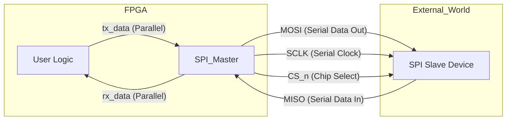

# Project 07: SPI Master Controller

This project implements a **Serial Peripheral Interface (SPI) Master** controller, a fundamental building block for communicating with external chips like Flash memory, sensors, and DACs.

## What is SPI?

SPI (Serial Peripheral Interface) is a synchronous serial communication interface used for short-distance communication, primarily in embedded systems.

### The Problem: Pin Constraint
Imagine an FPGA needs to talk to an external temperature sensor. The sensor outputs 16 bits of data. If we used a parallel bus, we would need 16 pins just for data! FPGAs have limited pins.
**Parallel Bus:** 16 wires = 16 pins. Expensive.

### The Solution: Serial Shift Registers
SPI solves this by serializing data. Instead of sending 16 bits at once, we send 1 bit at a time over a single wire, synchronized by a clock.
**Serial Bus:** 1 wire (Data) + 1 wire (Clock) = 2 pins. Efficient.

The core mechanism is a **Distributed Shift Register**:
1.  The Master (FPGA) has an 8-bit register.
2.  The Slave (Sensor) has an 8-bit register.
3.  On every clock tick, they swap one bit.
4.  After 8 ticks, the Master has the Slave's data, and the Slave has the Master's data.

## Overview
*   **Goal:** Interface with external peripherals using a standard 4-wire protocol.
*   **Key Feature:** Clean Moore Machine FSM (`IDLE` -> `CMD` -> `ADDR` -> `DATA`).
*   **Target:** Alinx AX7015B (Zynq 7015) Hardware Verification via Loopback.

## Architecture



The design generates a slow `spi_sclk` from the fast system clock and manages the timing of the Chip Select (`cs_n`) and data shifting.

## RTL Modules: Detailed Architecture

### 1. The Controller (`rtl/spi_master.sv`)
**Concept:**
A Finite State Machine (FSM) controls the shifting process. It ensures setup and hold times are met and drives the control signals.

**Key Logic:**
1.  **Clock Divider:** Generates the `sclk_en` pulses. We do *not* use a generated clock directly (bad practice); we use a clock enable on the system clock.
2.  **Shift Register:** A single register that shifts out `MOSI` at the MSB and shifts in `MISO` at the LSB.
3.  **FSM (Moore Machine):**
    *   `IDLE`: Waiting for `start` signal.
    *   `CS_LOW`: Assert Chip Select (Active Low).
    *   `TRANSFER`: Shift bits for `DATA_WIDTH` cycles.
    *   `CS_HIGH`: Deassert Chip Select.
    *   `DONE_STATE`: Signal completion to user logic.

**Interface:**
| Signal | Direction | Width | Description |
| :--- | :--- | :--- | :--- |
| `clk` | Input | 1 | Unit Clock (e.g., 50MHz) |
| `rst_n` | Input | 1 | Active-low Asynchronous Reset |
| `tx_data` | Input | 8 | Data to send to Slave |
| `start` | Input | 1 | Pulse to begin transaction |
| `rx_data` | Output | 8 | Data received from Slave |
| `done` | Output | 1 | Pulse when transaction complete |
| `spi_*` | In/Out | 1 | Physical SPI Pins (MOSI, MISO, SCLK, CS) |

## Usage

This project uses a `Makefile` to run the simulation and hardware build workflow.

### 1. Simulation (Verify Protocol)
Runs the SystemVerilog testbench (`tb/tb_spi_master.sv`) which connects `MOSI` to `MISO` (Loopback) and checks if sent data matches received data.
```bash
make sim
```
*Expected Output:*
```text
Test 1: Loopback 0xA5
Test 1 PASS: Rx Data match Tx Data (0xA5)
Test 2: Loopback 0x3C
Test 2 PASS: Rx Data match Tx Data (0x3C)
```

### 2. Hardware Test (Verify on Chip)
We implement a **Hardware Loopback Tester** on the Alinx AX7015B.
*   **Logic:** A counter increments every second. The SPI Master sends this value.
*   **Setup:** You connect a physical wire from Pin M1 to M2.
*   **Feedback:** If the wire is connected, the onboard LEDs count up.

```bash
# 1. Build the Bitstream
make build

# 2. Program the FPGA
make program
```

**Hardware Setup:**
*   **Pin M1 (MOSI)** <--> **Pin M2 (MISO)** (Connect these with a jumper wire)
*   **LEDs**: Show the received binary counter.

## Key Concepts Learned

1.  **PISO / SIPO (Parallel-In Serial-Out / Serial-In Parallel-Out):**
    *   This is the heart of all serial controllers (UART, SPI, I2C, USB).
    *   We convert wide internal buses (easy to use logic) to narrow external wires (cheap to manufacture).

2.  **Clock Domains & Enables:**
    *   *Bad:* Generated clocks (dividing a clock and using the result as a clock node). This causes clock skew.
    *   *Good:* Clock Enables (generating a 1-cycle pulse `sclk_en` and using it in `if(sclk_en)`). This keeps the design fully synchronous.

3.  **Modes (CPOL/CPHA):**
    *   SPI has 4 modes defining clock polarity and phase. This project implements **Mode 0** (Idle Low, Sample on Rise), which is the most common default for flash memory and sensors.

4.  **Simultaneous TX/RX Handling:**
    *   *Issue:* In a single shift register design, incoming MISO data sampled on the Rising Edge can overwrite outgoing MOSI data (LSB) before it is shifted out on the Falling Edge.
    *   *Fix:* Sample MISO into a temporary register (`miso_sample`) on the rising edge, then shift it into the main shift register on the falling edge. This preserves the transmit data integrity.

## Implementation Results & KPIs

The design was synthesized and implemented on the **Xilinx Zynq-7015 (xc7z015clg485-2)**.

### Resource Utilization
The design is extremely lightweight, consuming a negligible fraction of the Zynq 7015 fabric.

| Resource | Used | Total | Utilization % |
| :--- | :--- | :--- | :--- |
| **Slice LUTs** | 55 | 46,200 | 0.12% |
| **Slice Registers** | 68 | 92,400 | 0.07% |
| **IOB (Pins)** | 8 | 150 | 5.33% |
| **BUFG** | 1 | 32 | 3.13% |

### Timing Performance
*   **Target Clock:** 50 MHz (20.00 ns period)
*   **Worst Negative Slack (WNS):** +16.583 ns
*   **Max Theoretical Frequency:** ~292 MHz
*   **Logic Levels:** 3 (Low depth indicates good pipelining potential)

With a WNS of +16.5 ns, the design easily meets timing closure with substantial margin, making it suitable for integration into larger, high-speed systems without becoming a bottleneck.

## Verification
The design was verified through:
1.  **Simulation:** Checking waveforms for correct CPOL/CPHA timing.
2.  **Hardware Loopback:** Connecting MOSI (Pin M1) to MISO (Pin M2) on the AX7015B. The received data (counter values) is displayed on the LEDs, proving that data sent out is correctly received back.
