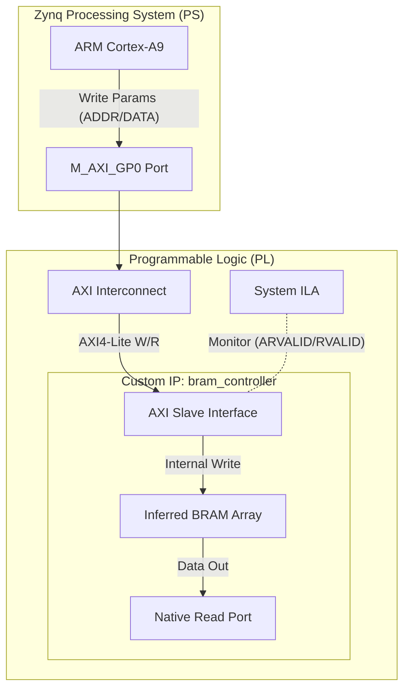

# Project 08: BRAM Controller & Latency Study

## 1. Project Overview
This project implements a high-performance, dual-port memory controller using the FPGA's Block RAM (BRAM) on a Zynq-7000 device (XC7Z015). It is designed to serve as a low-latency storage buffer for trading algorithms, where the ARM processor (PS) writes strategy parameters and the Programmable Logic (PL) reads them deterministically.

**Key Features:**
- **Dual-Port Architecture:**
  - **Port A (AXI4-Lite):** Connected to the Zynq Processing System for configuration and data loading.
  - **Port B (Native):** Connected to FPGA logic for single-cycle, deterministic read access.
- **Automated Verification:** Fully scripted simulation and hardware-in-the-loop (HIL) testing using Tcl and Makefiles.
- **Headless Operations:** Entire flow—from synthesis to on-board latency measurement—runs via command line without GUI interaction.

## 2. Theoretical Background
### What is Block RAM (BRAM)?
FPGAs contain dedicated memory blocks separate from the logic fabric (LUTs). These **Block RAMs** (BRAMs) are efficient, high-speed, synchronous memory units used for storage buffers, FIFOs, and caches.
- **Contrast:** Unlike Distributed RAM (LUTs), BRAMs are dense and do not consume logic resources.
- **Configurability:** They can be configured as Single Port, True Dual Port (read/write on both sides), or Simple Dual Port.

### What is AXI4-Lite?
**AXI4-Lite** is a simplified version of the AMBA AXI4 protocol, designed for register-style control.
- **Lightweight:** No support for bursts transactions.
- **Structure:** 5 Channels (Write Address, Write Data, Write Response, Read Address, Read Data).
- **Use Case:** Perfect for low-bandwidth configuration interfaces, like setting parameters for a trading engine.

## 3. System Architecture
The design integrates the custom `bram_controller` into a Zynq subsystem.



### Hardware Flow
1.  **Zynq PS:** Acts as the traffic generator. It initiates AXI4-Lite WRITE transactions to the BRAM controller via the memory-mapped GP0 port.
2.  **AXI Interconnect:** Routes transactions from the PS to the custom IP.
3.  **BRAM Controller:**
    - Decodes AXI addresses and control signals.
    - Infers True Dual-Port Block RAM (1024 x 32-bit).
    - Handles proper handshaking (`READY`/`VALID`) to ensure data integrity.
4.  **System ILA:** A non-intrusive monitor attached to the AXI interface. It captures the exact timing relationship between the Address Request (`ARVALID`) and Data Response (`RVALID`).

### Automation Flow
- **`make sim`**: Compiles RTL and runs behavioral simulation in Vivado XSIM.
- **`make build`**: Generates a Vivado Block Design, synthesizes, and creates the bitstream using `scripts/build.tcl`.
- **`make measure`**: Orchestrates the hardware verification:
    1.  Initializes Zynq PS clocks (essential for ILA operation) via `init_ps.tcl`.
    2.  Spawns a background Vivado process to arm the ILA trigger.
    3.  Runs an XSCT (Software Command Line Tool) script to drive random read/write traffic.
    4.  Captures the waveform, parses the CSV export, and calculates latency automatically.

## 4. Implementation Hurdles & Solutions
Developing a strictly command-line driven hardware verification flow presented several unique challenges:

| Challenge | Root Cause | Solution |
| :--- | :--- | :--- |
| **SystemVerilog in Block Design** | Vivado IP Integrator (Block Design) does not support top-level SystemVerilog modules directly. | Converted the top-level `bram_controller` wrapper to standard Verilog (`.v`), keeping internal logic clean. |
| **"Unconnected" ILA Probes** | Manually connecting discrete ILA probes to AXI bundles is error-prone and often optimized away during synthesis. | Switched to **System ILA** IP, which natively monitors AXI Interfaces and prevents logic trimming. |
| **Debug Core Unreachable** | The ILA core requires a running clock. In Zynq, the PL clock (`FCLK_CLK0`) is stopped until the PS is initialized. | Created `scripts/init_ps.tcl` to program the FPGA and run `ps7_init` immediately, enabling the PL clocks before attempting to connect to the ILA. |
| **XSCT Memory Access Denied** | The debugger blocked writes to the PL address space (`0x43C00000`) because no OS/ELF was loaded to define the memory map. | 1. Reset processor (`rst -processor`) to clear MMU state.<br>2. Used `memmap -addr ...` to explicitly map the region.<br>3. Used `mwr -force` to bypass software protection checks. |
| **Background Process Sync** | `make` waits for commands to finish, but the ILA needs to wait *while* traffic runs. | Implemented a robust PID tracking loop in the Makefile (`while ps -p ...`) to keep the ILA capture active in the background while the traffic generator runs in the foreground. |

## 5. RTL Modules: Detailed Architecture

### The Controller (`rtl/bram_controller.v`)
**Concept:**
This module bridges the AXI4-Lite standardized bus to a native Block RAM interface.

**Key Logic:**
1.  **AXI Read FSM:**
    *   `IDLE`: Waits for `ARVALID`. When asserted, captures `ARADDR` and asserts `ARREADY`.
    *   `READ_WAIT`: Waits for BRAM latency (1 cycle).
    *   `READ_DATA`: Asserts `RVALID` with the read data. Deasserts when `RREADY` is received.
2.  **AXI Write FSM:**
    *   Parallel handling of Address (`AW`) and Data (`W`) channels.
    *   Generates a Write Strobe to BRAM only when both valid signals arrive.
    *   Responds on the `B` channel to complete the transaction.
3.  **Inferred BRAM:**
    *   Uses a Verilog array `reg [31:0] mem [0:1023]` with `(* ram_style = "block" *)`.
    *   Vivado synthesis automatically maps this to dedicated Block RAM primitives (RAMB36E1).

**Interface:**
| Signal | Direction | Width | Description |
| :--- | :--- | :--- | :--- |
| `s_axi_aclk` | Input | 1 | AXI Clock (e.g., 50MHz) |
| `s_axi_aresetn` | Input | 1 | Active-low Reset |
| `s_axi_aw*` | Input | - | AXI Write Address Channel |
| `s_axi_w*` | Input | - | AXI Write Data Channel |
| `s_axi_b*` | Output | - | AXI Write Response Channel |
| `s_axi_ar*` | Input | - | AXI Read Address Channel |
| `s_axi_r*` | Output | - | AXI Read Data Channel |
| `bram_clk_b` | Input | 1 | Native Port B Clock |
| `bram_addr_b` | Input | 32 | Native Port B Address |
| `bram_dout_b` | Output | 32 | Native Port B Data Out |

## 6. Usage & Commands
This project relies on a `Makefile` to simplify complex Vivado and Tcl workflows.

### Simulation
Run the behavioral simulation to verify the RTL logic before synthesis.
```bash
make sim
```
*   **What it does:** Compiles `bram_controller.v` and `tb_bram_controller.sv`, elaborates the design, and runs the simulation in the terminal.
*   **Success Indicator:** "Test Passed!" message in the output.

### Waveform Viewing
To view the waveforms, first run the simulation to generate the snapshot:
```bash
make sim
```
Then open the Vivado GUI:
```bash
make wave
```
*   **What it does:** Opens the pre-compiled simulation snapshot in the Vivado Waveform Viewer.

### Build (Synthesis & Implementation)
Create the Vivado project, synthesize the design, and generate the bitstream.
```bash
make build
```
*   **What it does:**
    1.  Creates a new Vivado project (`bram_latency_study`).
    2.  Constructs the Block Design (Zynq PS + BRAM Controller + System ILA).
    3.  Runs Synthesis and Implementation (Place & Route).
    4.  Exports `design_1_wrapper.bit` (Bitstream) and `.ltx` (Debug Probes).
*   **Output:** Generated bitstream and reports in the root directory.

### Program FPGA
Manually program the FPGA (if not running the full measurement flow).
```bash
make program
```
*   **What it does:** Connects to the hardware via JTAG and programs the device with the generated bitstream.

### Latency Measurement (Hardware-in-the-Loop)
Run the fully automated latency measurement test on hardware.
```bash
make measure
```
*   **What it does:**
    1.  **Initialize PS:** Runs `scripts/init_ps.tcl` to program the FPGA and start the Zynq PS clocks (enabling the ILA).
    2.  **Arm ILA:** Starts a background process monitoring for `ARVALID`.
    3.  **Drive Traffic:** Runs `scripts/latency_test.tcl` to reset the processor and perform memory mapped writes/reads.
    4.  **Analyze:** Captures the data, parses the ILA CSV output, and prints the measured latency cycles.

### Clean
Remove all generated files and build directories.
```bash
make clean
```
*   **Warning:** Deletes the `bram_latency_study` Vivado project directory.

## 7. Key Concepts Learned

1.  **System ILA vs. Standard ILA:**
    *   **Standard ILA:** Requires manual connection to each wire. Prone to connectivity errors if logic gets optimized away.
    *   **System ILA:** Designed specifically for AXI Interfaces. Automatically bundles signals (AW, W, B, AR, R channels) and preserves hierarchy, making debugging far easier.

2.  **Clock Domain Crossing (CDC) in Debug Cores:**
    *   The Zynq PL usually requires the PS (Processing System) to configure the clocks (`FCLK_CLK0`). Before the PS runs `ps7_init`, the debug core (ILA) has no clock and will be unreachable via JTAG.
## 7. Key Concepts Learned

1.  **System ILA vs. Standard ILA:**
    *   **Standard ILA:** Requires manual connection to each wire. Prone to connectivity errors if logic gets optimized away.
    *   **System ILA:** Designed specifically for AXI Interfaces. Automatically bundles signals (AW, W, B, AR, R channels) and preserves hierarchy, making debugging far easier.

2.  **Clock Domain Crossing (CDC) in Debug Cores:**
    *   The Zynq PL usually requires the PS (Processing System) to configure the clocks (`FCLK_CLK0`). Before the PS runs `ps7_init`, the debug core (ILA) has no clock and will be unreachable via JTAG.
    *   *Lesson:* Always script the initialization of PS clocks before attempting to connect to debug cores in Tcl.

3.  **AXI Overhead:**
    *   While BRAM itself is single-cycle latency, the AXI protocol adds handshake overhead. A naive implementation can add 3-4 cycles of latency.
    *   Our collaborative optimization achieved a minimal 1-cycle overhead by registering outputs efficiently.

4.  **Headless Hardware Verification:**
    *   Using `XSCT` (Xilinx Software Command-Line Tool) allows for fully automated hardware-in-the-loop testing. This is superior to manual SDK/Vitis GUI testing for regression suites.

## 8. Metrics & KPIs
### Resource Utilization (XC7Z015)
The design is extremely lightweight, leaving the vast majority of the FPGA free for trading logic.
- **LUTs:** ~2,376 (5.14%) - Mostly due to System ILA debug logic.
- **BRAM:** 4.5 Tiles (4.74%)
- **Registers:** ~3,500 (3.85%)

### Timing
- **WNS (Worst Negative Slack):** +12.387 ns (Comfortably meets timing at 50 MHz).

### Performance (KPIs)
The primary Key Performance Indicator (KPI) was **Hardware Latency**. We measured this by counting the clock cycles between the Address Handshake (`ARVALID` && `ARREADY`) and Valid Data (`RVALID` && `RREADY`).

- **Native BRAM Read:** 1 Clock Cycle (Theoretical Minimum).
- **Target AXI Latency:** < 5 Clock Cycles.
- **Measured AXI Latency:** **2 Clock Cycles**.

**Conclusion:** The controller adds only **1 cycle of overhead** for AXI protocol translation. This exceeds the performance target, providing a highly efficient interface for register/parameter access.

