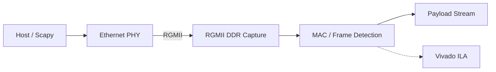

# Project 09: Gigabit Ethernet RX Bring-Up

## Overview

This project brings up a custom **RGMII receive path** on the ALINX AX7015B (Zynq-7015) and documents the hardware-debugging process used to recover correct packet capture.

The project is primarily evidence of **hardware integration and validation work** rather than a production Ethernet MAC or a certified performance benchmark.

## What Was Demonstrated

- RGMII receive clocking at **125 MHz** with DDR input capture.
- Conversion from the 4-bit DDR RGMII bus to an 8-bit internal receive path.
- Packet injection from a host using Python/Scapy.
- Vivado ILA inspection of received preamble/SFD and payload data.
- Recovery from corrupted frame capture by changing the receive-clock phase.
- Repeatable Vivado/Tcl/Make build and hardware-debug workflow.

## Important Interpretation

**1 Gbps** is the nominal Ethernet line rate represented by the 125 MHz, 4-bit, double-data-rate RGMII interface:

`125 MHz × 4 bits × 2 edges = 1 Gbit/s`.

The hardware tests showed that the receive path could capture injected Gigabit Ethernet frames correctly. This repository does **not** contain a sustained-throughput benchmark establishing 1 Gbit/s application payload throughput.

Earlier documentation also described **0% BER** and **0% packet loss**. Those claims were too strong for the evidence collected. ILA inspection of a limited set of frames can confirm correct observed captures, but it is not a formal BER or packet-loss campaign.

## Architecture



### RGMII interface

The receive path uses FPGA DDR input primitives and the PHY-provided receive clock. During bring-up, corrupted SFD capture was traced with ILA to clock/data alignment.

The working configuration used receive-clock phase inversion with the delay setting returned to its baseline value.

### MAC receive logic

The receive state machine detects Ethernet preamble/SFD and exposes payload bytes to downstream logic.

## Hardware Debugging Evidence

The useful engineering result in this project is the debugging sequence:

1. Inject known packets from the host.
2. Capture the physical receive path with Vivado ILA.
3. Observe the incorrect frame-start pattern.
4. Compare clock-phase/delay configurations.
5. Restore the receive clock alignment.
6. Re-run packet injection and confirm correct frame capture.

This is the evidence behind the portfolio's claim that the RGMII receive path was brought up successfully on physical hardware.

## Latency

Previous versions of this README presented a sub-100 ns latency number as though it were a hardware measurement.

That was not sufficiently supported. Any latency obtained from RTL cycle counting or behavioral simulation should be treated as a **derived/model result**, not an independent time-domain measurement of the complete PHY-to-output path.

No end-to-end latency benchmark is claimed here.

## Usage

```bash
make sim
make build
make program
make debug
make test
```

- `make debug` opens the hardware-debug flow for ILA capture.
- `make test` injects host-generated Ethernet traffic for receive-path validation.

## Scope and Limitations

This is a development/validation project. It does not claim:

- formal Ethernet compliance testing;
- measured zero BER;
- measured zero packet loss;
- certified sustained 1 Gbit/s payload throughput;
- an oscilloscope-verified sub-100 ns latency result.

Its strongest evidence is successful physical RGMII bring-up, packet capture, ILA-guided fault isolation, and recovery of correct frame reception.
