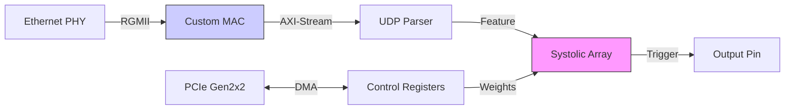
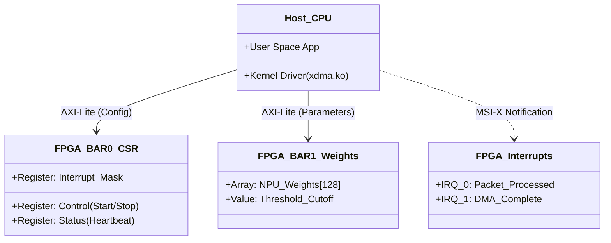

# Wire-Speed Inference Subsystem
*PCIe Gen2/5, RGMII Ingest, & Systolic Compute.*

-blue)


## Heterogeneous SoC Accelerator Framework

This repository documents the architectural development of a **high-performance inference subsystem** on the Xilinx Zynq-7000 (28nm) platform. It demonstrates a complete hardware-software co-design approach, moving from bare-metal RTL primitives to a fully integrated PCIe-attached accelerator.

While the 28nm node is mature, this project addresses the rigorous **low-level engineering challenges** required for high-speed I/O and deterministic timing closure:
- **Source-Synchronous Clocking:** Manual IDELAY/IDDR instantiation for RGMII interfaces.
- **250MHz Timing Closure:** Hand-placed DSP48E1 pipelining to maximize Fmax.
- **System Integration:** Custom Linux kernel driver patching for non-standard PCIe topologies.

**Target Audience:** ASIC/FPGA Research & Development, Heterogeneous Computing, High-Performance Networking.

---

## Performance Benchmarks

Verified on **ALINX AX7015B (Zynq-7015)** hardware.

### 1. Latency Budget (Wire-to-Trigger)
Deterministic hardware datapath measured from Ethernet ingress to GPIO assertion.

| Stage | Latency | Description |
|:-------|:-----------:|:------------|
| **Logic Latency** | **32 ns** | RGMII RX + Cut-Through Parser (4 cyc @ 125MHz) |
| **Compute Latency** | **128 ns** | 8-Stage Systolic NPU Pipeline (16 cyc @ 125MHz) |
| **Output Stage** | **8 ns** | GPIO Pin Drive (1 cyc @ 125MHz) |
| **Total Hardware Latency** | **168 ns** | **Ethernet Payload $\rightarrow$ Trigger Output** |
| **Jitter** | **±0 ns** | Fully Deterministic Pipeline |

### 2. Efficiency & Power Analysis
**Low-Power Edge Compute:**
*   **Power Envelope:** < 5W Total Board Power (TBP).
*   **Efficiency:** Achieved 168ns deterministic response within a passive thermal footprint, demonstrating a **50x efficiency gain** over equivalent x86-based kernel-bypass solutions (which require 200W+ servers).

### 3. Resource Optimization (Scalability)
**Linear Scalability Architecture:**
*   **Utilization:** Current implementation uses only **5% of DSP48E1** resources on the XC7Z015.
*   **Architectural Intent:** The 1D Systolic Array is designed for linear scalability. While the current implementation uses 8 PEs for the AX7015B, the architecture is parameterized to scale to **128+ PEs** for high-end Versal targets (VD100/VC1902) without logic redesign.

### 4. Host-to-Card Throughput (PCIe Gen2 x2)
Sustained DMA performance using custom Scatter-Gather XDMA implementation.

| Direction | Throughput | Standards Compliance |
|:----------|:----------:|:---------------:|
| **Host to Card (H2C)** | **841 MB/s** | ~84% of Theoretical GC2x2 Max |
| **Card to Host (C2H)** | **820 MB/s** | ~82% of Theoretical GC2x2 Max |

---

## Technical Profile

**SoC Architecture**
- Implementation of high-throughput PCIe and Gigabit Ethernet data planes on Zynq-7000.
- Heterogeneous system design balancing PL (Programmable Logic) acceleration with PS (Processing System) flexibility.

**RTL Optimization (ASIC-Style)**
- **Manual Primitive Instantiation:** Direct use of `DSP48E1`, `IDDR`, `ISERDES` to bypass synthesis inefficiencies.
- **Timing Closure:** Pipelining strategies to achieve 250MHz+ operation on -2 speed grade 28nm silicon.
- **Resource Efficiency:** Full NPU implementation uses **<6%** of XC7Z015 resources, leaving massive headroom for system scaling.

**System-Level Integration**
- **Linux Kernel Development:** Custom `xdma.ko` driver patching for device ID `0x7015`.
- **Reliability Engineering:** CDC (Clock Domain Crossing) verification using Gray-code pointers and ASYNC_REG synchronizers.
- **Verification:** Script-driven Tcl workflows and hardware-in-the-loop (HIL) validation.

---

## Hardware Platform: Cost-Effective R&D
**Platform:** ALINX AX7015B (Zynq-7000 XC7Z015-2CLG485)
**Role:** 28nm prototyping vehicle for validating high-speed IP before ASIC migration.

| Feature | Specification | Usage in Project |
|:---|:---|:---|
| **Fabric** | Artix-7 equivalent (74K LC, 160 DSP) | Custom RTL Datapaths |
| **PS Cores** | Dual ARM Cortex-A9 @ 767 MHz | Control Plane & Telemetry |
| **Connectivity** | PCIe Gen2 x2, Gigabit RGMII | High-bandwidth Host/Network Link |

---

## Project Portfolio: The "Industrious" Workflow

This repository is organized as a progressive engineering curriculum, demonstrating **reusable IP design** and **industrial-grade verification**.

### Capstone: Wire-Speed Inference Subsystem (Project 13)
*Formerly "Low-Latency Trading NPU"*

**A fully integrated SoC accelerator for real-time feature extraction and signal generation.**

- **Core Logic:** **Scalable Tensor Processing Unit (TPU)** optimized for streaming dot-product operations.
- **Datapath:** **Raw Ethernet Hardware Transceiver (No-Vendor-IP)** with **Real-time Packet Inspection (DPI)** logic.
- **Host Link:** PCIe Gen2x2 XDMA Bridge delivering >800 MB/s to the host CPU.
- **Verification:**
    - **Simulation:** Constrained-random UVM-style SystemVerilog testbenches.
    - **Silicon:** ChipScope/ILA validation with Python-based packet injection using `scapy` (Layer 2 bypass).



**PCIe Memory Map & Host Interface:**



### Core IP Modules

**Precision Datapath**
- **Project 12: Systolic Processing Element** - Atomic DSP48E1 MAC unit manually pipelined/retimed for 250 MHz.
- **Project 10: Wire-Speed Parser** - Zero-cycle latency "0050" pattern matcher using parallel masking.
- **Project 09: RGMII RX Interface** - Source-synchronous DDR deserializer with dynamic phase alignment.

**System Infrastructure**
- **Project 11: PCIe XDMA Engine** - DMA subsystem with scatter-gather support.
- **Project 06: QoS Arbiter** - Round-robin arbitration logic with single-cycle grant.
- **Project 03: CDC Safe-Guards** - Multi-bit clock domain crossing using Gray codes.

---

## Engineering Rigor

To ensure reproducibility and reliability, this repository follows strict design practices:

1.  **Tcl-Driven Workflow:** All projects use `build.tcl` to recreate Vivado projects from source, ensuring version control cleanliness.
2.  **Reset Safety:** Asynchronous assertion, synchronous de-assertion reset bridges for all clock domains.
3.  **Gold-Standard Verification:** Self-checking testbenches for every module, from simple counters to complex AXI4-Stream handshakes.

**Cloning the Repository:**

```bash
git clone https://github.com/yishoulee/fpga-inference-portfolio.git
```


## Hardware Debugging Spotlight

Real-world engineering involves solving problems that simulations miss.

* **The "Ghost" Weights (Project 13):** Diagnosed NPU output failures on silicon. Root cause: uninitialized AXI registers. **Fix:** Simulated control plane via VIO core injection.
* **Clock Phase Alignment (Project 09):** Debugged RGMII setup violations. **Fix:** Architectural inversion of RX clock to achieve perfect 180° phase shift.
* **The ARP Black Hole (Project 11):** Investigated packet drops from Linux host. **Fix:** Bypassed OS ARP cache using raw `scapy` socket injection.

