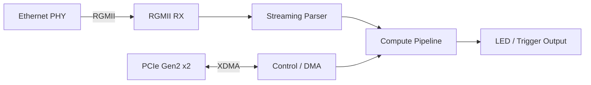

# Zynq-7000 Hardware/Software Integration & Validation Portfolio
*RGMII receive-path bring-up, FPGA datapaths, PCIe XDMA, Linux integration, and repeatable validation on real hardware.*

-blue)


## Overview

This repository documents 13 progressive FPGA and hardware/software integration projects on an **ALINX AX7015B (Zynq-7015)**. The work covers SystemVerilog RTL, Vivado/Tcl build automation, RGMII Ethernet receive-path debugging, PCIe XDMA, Linux driver integration, AXI/BRAM control paths, and hardware-in-the-loop validation.

The strongest evidence in the repository is the **integration and debugging workflow**: packet injection, ILA/VIO capture, reproducible builds, timing/utilization notes, host-side transfer scripts, and physical board validation.

## Evidence Summary

### Hardware validation

- **RGMII Ethernet:** brought up the 125 MHz DDR receive path on physical hardware and validated injected frames using Scapy and Vivado ILA.
- **PCIe Gen2 x2 XDMA:** Project 11 records a host-side benchmark reaching **841 MB/s H2C** and read performance above **590 MB/s**; the reproducible test script is included.
- **Integrated Project 13:** received injected packets, matched the configured feature pattern, propagated data through the compute path, and drove the expected LED classification outputs.

### Implementation and timing notes

- **Project 13 integrated datapath:** **125 MHz**.
- **Recorded Project 13 implementation:** **1,165 LUTs (2.5%)**, **2,118 FFs (2.3%)**, **8 DSPs (5.0%)**.
- **Recorded core setup result:** **WNS +1.175 ns** at 125 MHz.
- **Important limitation:** Project 13 timing status remains **Mixed** because CDC paths were still flagged and require explicit constraints.
- **Project 12:** separately exercises a DSP48E1 processing element at **250 MHz**. This is an isolated PE experiment, not the integrated Project 13 clock rate.

### Latency

The NPU RTL intentionally delays `result_valid` through a **16-cycle pipeline**. At 125 MHz, that corresponds to a **128 ns cycle-derived internal pipeline interval**.

The repository does **not** claim a verified end-to-end packet-to-output latency. Earlier 168 ns and 184 ns totals used different stage assumptions and have been removed from the portfolio summary.

No measured zero-jitter result is claimed.

## System Integration

- **Network ingest:** custom RGMII receive path using FPGA DDR input primitives and ILA-guided debugging.
- **Packet processing:** streaming pattern parser feeding an 8-stage compute path.
- **Host link:** PCIe Gen2 x2 through Xilinx XDMA.
- **Control:** AXI/AXI-Lite and BRAM-based experiments.
- **Linux:** XDMA driver integration and host-side transfer/testing scripts.
- **Verification:** Vivado XSim, SystemVerilog testbenches, Tcl/Make builds, ILA/VIO, Python and Scapy.


```mermaid
graph LR
    PHY[Ethernet PHY] -->|RGMII| RX[RGMII RX]
    RX --> PARSER[Streaming Parser]
    PARSER --> NPU[Compute Pipeline]
    NPU --> GPIO[LED / Trigger Output]
    PCIe[PCIe Gen2 x2] <-->|XDMA| CTRL[Control / DMA]
    CTRL --> NPU
```

## Project Map

### Data path and compute

- **Project 13 — Integrated Packet-to-Compute Pipeline:** network → parser → compute → observable output.
- **Project 12 — Systolic Processing Element:** separate DSP48E1 MAC experiment, including a 250 MHz test.
- **Project 10 — Streaming Parser:** target-pattern detection and packet-processing logic.
- **Project 09 — Gigabit Ethernet RX Bring-Up:** RGMII receive-path integration and clock-alignment debugging.

### System infrastructure

- **Project 11 — PCIe XDMA Linux Integration:** host↔card DMA and Linux integration.
- **Project 08 — BRAM Controller Latency Study:** AXI/BRAM register-access path.
- **Project 06 — QoS Arbiter:** round-robin arbitration logic.
- **Project 03 — CDC:** synchronization and multi-clock-domain experiments.

## Reproducibility

Projects use source-controlled RTL and Tcl/Make-based workflows so builds can be recreated without relying on checked-in Vivado project state. Where available, the repository includes test scripts and project notes for the recorded results.

## Hardware Debugging Examples

- **RGMII alignment:** used Vivado ILA to trace corrupted frame-start behavior and recover correct frame reception.
- **Project 13 configuration:** traced zero compute output to uninitialized weights and used VIO to inject validation values.
- **PCIe benchmark:** traced an apparent ~150 MB/s bottleneck to benchmark methodology; moving random-data generation outside the timed region produced the recorded 841 MB/s H2C result.
- **Host networking:** used raw Scapy Layer-2 injection to bypass ARP-dependent host behavior during receive-path testing.

## Claims deliberately not made

This portfolio does **not** claim:

- a measured zero BER or zero packet-loss result;
- a certified sustained 1 Gbit/s application-throughput benchmark;
- zero-copy userspace XDMA;
- an independently archived 820 MB/s C2H result;
- an oscilloscope-verified packet-to-output latency;
- zero timing jitter;
- globally clean CDC timing;
- a measured FPGA-vs-CPU energy-efficiency multiplier.

## Hardware

- **Board:** ALINX AX7015B
- **Device:** Xilinx Zynq-7000 XC7Z015-2CLG485
- **Interfaces used:** RGMII Ethernet, PCIe Gen2 x2, DDR3, JTAG

## Clone

```bash
git clone https://github.com/yishoulee/fpga-inference-portfolio.git
```
