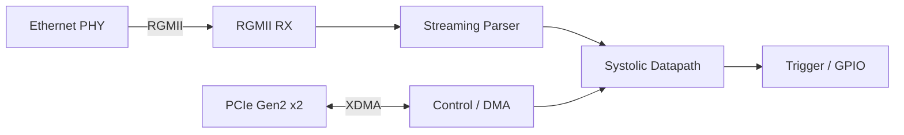

# Zynq-7000 Hardware/Software Integration & Validation Portfolio
*RGMII ingest, FPGA datapaths, PCIe XDMA, Linux integration, and repeatable validation on real hardware.*

-blue)


## Overview

This repository documents 13 progressive FPGA and hardware/software integration projects on an **ALINX AX7015B (Zynq-7015)**. The work covers SystemVerilog RTL, Vivado/Tcl build automation, RGMII Ethernet receive-path debugging, PCIe XDMA, Linux driver integration, AXI/BRAM control paths, and hardware-in-the-loop validation.

The emphasis is on **reproducible engineering evidence**: build scripts, timing/utilization reports, test scripts, ILA/VIO debugging, and measured host↔card throughput.

## Evidence Summary

### Measured on hardware

- **Gigabit Ethernet:** stable 1 Gbps RGMII receive path validated with packet injection and Vivado ILA.
- **PCIe Gen2 x2 XDMA:** **841 MB/s host-to-card** and **820 MB/s card-to-host** using the XDMA transfer tools.
- **Integrated loopback:** Project 13 received injected packets and asserted the expected LED/trigger behavior on the AX7015B.

### Implementation and timing-report evidence

- **Project 13 integrated datapath:** runs at **125 MHz**.
- **Place & route:** **1,165 LUTs (2.5%)**, **2,118 FFs (2.3%)**, and **8 DSPs (5.0%)**.
- **Core timing:** 125 MHz setup timing met with **WNS +1.175 ns** in the recorded Project 13 result.
- **Important limitation:** Project 13's timing status is recorded as **Mixed** because CDC paths were still flagged and require explicit constraints.
- **Project 12:** separately exercises a DSP48E1 processing element at **250 MHz**. This is an isolated project result, not the clock rate of the integrated Project 13 datapath.

### Cycle-derived latency

The integrated RTL path contains **21 pipeline cycles at 125 MHz**, giving a **168 ns FPGA-logic latency budget** from the documented stage count:

| Stage | Cycles | Derived time |
| --- | ---: | ---: |
| RGMII RX + MAC/parser | 4 | 32 ns |
| NPU pipeline | 16 | 128 ns |
| GPIO output stage | 1 | 8 ns |
| **Total FPGA logic** | **21** | **168 ns** |

This **168 ns figure is derived from the RTL cycle count**. It excludes PHY delay and is not presented as an independent oscilloscope measurement. No zero-jitter hardware measurement is claimed.

### Not benchmarked here

Power-efficiency comparisons against x86 systems, large-array scaling to future FPGA families, and other platform projections are **not measured results in this repository** and are therefore not presented as performance claims.

---

## System Integration

- **Network ingest:** custom RGMII receive path using FPGA DDR input primitives and hardware debugging.
- **Packet processing:** streaming parser feeding an 8-stage systolic compute path.
- **Host link:** PCIe Gen2 x2 through Xilinx XDMA.
- **Control:** AXI/AXI-Lite and BRAM-based configuration paths.
- **Linux:** XDMA driver integration and host-side transfer/testing scripts.
- **Verification:** Vivado XSim, self-checking testbenches, Tcl builds, ILA/VIO, Python and Scapy.


```mermaid
graph LR
    PHY[Ethernet PHY] -->|RGMII| RX[RGMII RX]
    RX --> PARSER[Streaming Parser]
    PARSER --> NPU[Systolic Datapath]
    NPU --> GPIO[Trigger / GPIO]
    PCIe[PCIe Gen2 x2] <-->|XDMA| CTRL[Control / DMA]
    CTRL --> NPU
```

## Project Map

### Data path and compute

- **Project 13 — Deterministic-Latency Inference Engine:** integrated network → parser → compute → trigger path.
- **Project 12 — Systolic Processing Element:** DSP48E1-based MAC experimentation, including the separate 250 MHz test.
- **Project 10 — Market/Data Parser:** streaming signature detection and packet-processing logic.
- **Project 09 — Gigabit Ethernet RX:** RGMII receive-path bring-up and phase/alignment debugging.

### System infrastructure

- **Project 11 — PCIe XDMA Engine:** host↔card DMA and Linux integration.
- **Project 08 — BRAM Controller Latency Study:** AXI/BRAM register-access path.
- **Project 06 — QoS Arbiter:** round-robin arbitration logic.
- **Project 03 — CDC:** synchronization and multi-clock-domain experiments.

## Reproducibility

Projects use source-controlled RTL and Tcl/Make-based workflows so builds can be recreated without relying on checked-in Vivado project state. Where applicable, the repository includes timing/utilization reports, hardware test scripts, and debug-probe workflows.

## Hardware Debugging Examples

- **RGMII alignment:** used Vivado ILA to trace corrupted frame-start behavior and recover stable receive operation.
- **Project 13 control path:** traced zero NPU output to uninitialized control registers and used VIO to inject weights/thresholds for hardware validation.
- **PCIe benchmark:** traced an apparent ~150 MB/s bottleneck to the Python timing method; correcting the benchmark produced the recorded **841 MB/s** H2C result.
- **Host networking:** used raw Scapy Layer-2 injection to bypass host ARP behavior during packet testing.

## Hardware

- **Board:** ALINX AX7015B
- **Device:** Xilinx Zynq-7000 XC7Z015-2CLG485
- **Connectivity used:** Gigabit RGMII, PCIe Gen2 x2, DDR3, JTAG

## Clone

```bash
git clone https://github.com/yishoulee/fpga-inference-portfolio.git
```
