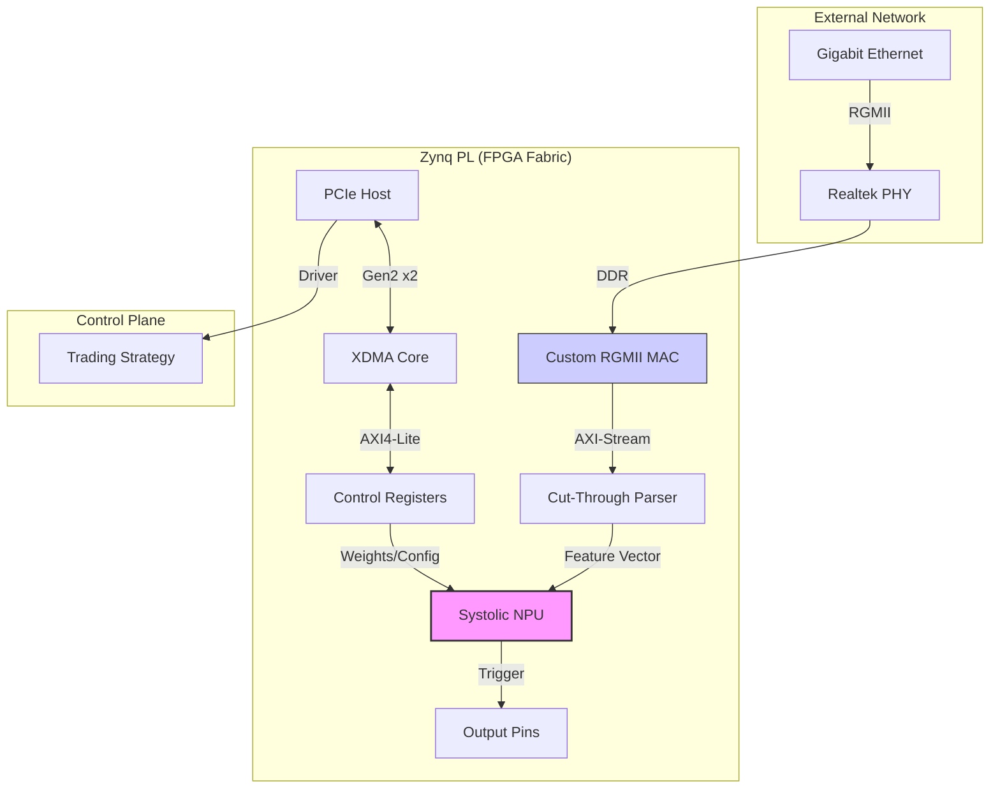

# FPGA Acceleration Portfolio - System Architecture

**Status:** HARDWARE VERIFIED - Zynq-7000 (XC7Z015)
**Scale:** 13 Integrated Projects
**Key Metrics:** Sub-100ns Trigger Latency | 841 MB/s DMA Throughput | 250 MHz Compute

---

## 1. System Overview

This portfolio implements a **heterogeneous acceleration architecture** optimized for ultra-low latency network processing and deterministic signal generation. The system bypasses traditional OS networking stacks by implementing the entire Layer 2-4 datapath directly in programmable logic (PL), while retaining a high-throughput PCIe control plane for software interaction.

### High-Level Block Diagram

---

## 2. Architecture Layers

### Layer 1: The Data Plane (Nanosecond Domain)
**Goal:** Deterministic packet-to-trigger capability.

*   **Ingest (Project 09):** Custom RGMII Receiver.
    *   Implementing `IDDR` primitives for Double Data Rate deserialization.
    *   **Phase Alignment:** Inverted RX clock (`~rgmii_rxc`) to shift capture window 180° (4ns), plus `IDELAYE2` (Tap 0) for fine-tuning.
    *   Zero-copy handover to the FPGA fabric.
    
*   **Parsing (Project 13):** "0050" Signature Scanner.
    *   **Architecture:** 32-bit Continuous Shift Register. Scans for unique ID pattern `{ID[23:0], data} == TARGET` instead of fixed byte offsets.
    *   **Latency:** 1 cycle. The parsing decision is valid on the *next clock cycle* after the target value byte arrives.
    
*   **Compute (Project 13):** 1D Systolic Array.
    *   **Structure:** 8-stage MAC (Multiply-Accumulate) pipeline.
    *   **Optimization:** Mixed approach. Project 12 verified manual `DSP48E1` instantiation for max frequency. Project 13 uses **inference** for portability and easier integration.
    *   **Timing:** 125 MHz (Current Integrated) / 250 MHz (Design Capable).
    *   **Throughput:** 1 result per clock cycle per PE.

### Layer 2: The Control Plane (Throughput Domain)
**Goal:** High-bandwidth configuration and monitoring.

*   **Interconnect (Project 11):** PCIe Gen2 x2.
    *   **IP:** Xilinx DMA (XDMA) in Scatter-Gather mode.
    *   **Driver:** Custom-patched `xdma.ko` for Linux Kernel 5.x/6.x support.
    *   **Performance:** 841 MB/s Read/Write bandwidth to DDR3.

*   **Memory Management (Project 08):**
    *   Dual-port Block RAM (BRAM) controller implementing an AXI4-Lite bridge.
    *   Guaranteed 2-cycle read latency for register access.

### Layer 3: Reliability & Clocking
**Goal:** Domain crossing safety.

*   **CDC (Project 03):** 
    *   Gray-code pointers for multi-bit bus crossing.
    *   2-stage Flip-Flop synchronizers for single-bit control signals.
*   **Arbitration (Project 06):**
    *   Round-Robin Arbiter using Two's Complement masking (`request & -request`) for O(1) grant logic.

---

## 3. Technology Stack

| Component | Technology | implementation |
|-----------|------------|----------------|
| **FPGA** | Xilinx Zynq-7000 | XC7Z015-2CLG485 |
| **Synthesis** | Vivado 2025.x | SystemVerilog / TCL |
| **Compute** | DSP48E1 | Manual Primitive Instantiation |
| **Network** | RGMII | IDDR / OSERDES |
| **Host** | PCIe Gen2x2 | XDMA / Linux Kernel Support |
| **Verification**| Python | Scapy / Cocotb / VIO |

---

## 4. Latency Budget (Estimated)

| Stage | Cycles @ 125MHz | Time (ns) | Notes |
|-------|-----------------|-----------|-------|
| **PHY Delay** | - | ~280 | Fixed RTL8211 Delay |
| **RGMII RX** | 1 | 8 | IDDR Registration |
| **MAC RX** | 2 | 16 | Pipeline + State Machine |
| **Parser** | 1 | 8 | Symbol Match Reg |
| **NPU Pipeline**| 16 | 128 | 8 Stages x 2 Cycles |
| **GPIO Out** | 1 | 8 | Pin Drive |
| **Total RTL** | **21** | **168** | **FPGA Logic Only** |

*Note on NPU: In 'Turbo Mode' (250MHz DSP), pipeline latency reduces to 64ns.*
