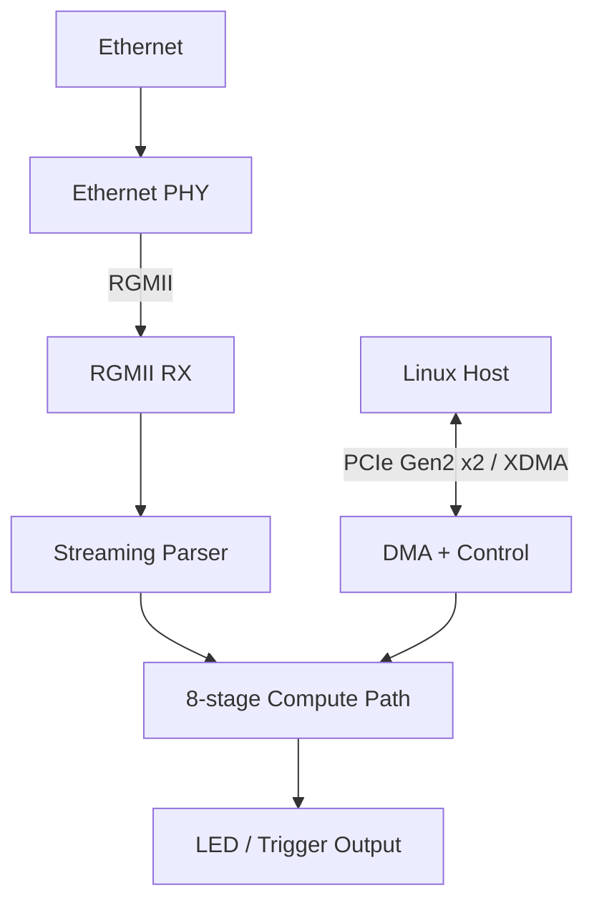

# FPGA Portfolio — System Architecture

**Platform:** ALINX AX7015B / Zynq-7000 XC7Z015  
**Scale:** 13 progressive projects  
**Evidence highlights:** physical RGMII receive-path bring-up, Linux/XDMA integration, recorded 841 MB/s H2C benchmark, and integrated Project 13 operation at 125 MHz.

## 1. System Overview

The portfolio combines a programmable-logic packet-processing path with a PCIe/Linux control and data-transfer path.

```mermaid
graph TD
    ETH[Ethernet] --> PHY[Ethernet PHY]
    PHY -->|RGMII| RX[RGMII RX]
    RX --> PARSER[Streaming Parser]
    PARSER --> NPU[8-stage Compute Path]
    NPU --> OUT[LED / Trigger Output]
    HOST[Linux Host] <-->|PCIe Gen2 x2 / XDMA| CTRL[DMA + Control]
    CTRL --> NPU
```

## 2. RGMII Data Path

- FPGA DDR input capture driven by the PHY receive clock.
- ILA-guided bring-up and clock-alignment debugging.
- Host-generated Scapy frames used as controlled test traffic.
- Correct frame reception observed on physical hardware.

The 125 MHz DDR interface represents Gigabit Ethernet signaling, but no sustained application-throughput, BER, or packet-loss benchmark is claimed.

## 3. Parser and Compute

- Streaming pattern detection feeds an 8-stage MAC compute path.
- The integrated Project 13 design runs at **125 MHz**.
- The NPU `result_valid` path is intentionally delayed by **16 cycles**, corresponding to a cycle-derived 128 ns internal interval.
- The complete packet-to-output latency has not been independently measured.

Project 12's separate DSP48E1 PE experiment runs at **250 MHz** and is not used as the integrated-system clock claim.

## 4. PCIe / Linux Path

- PCIe Gen2 x2 using Xilinx XDMA.
- Linux host integration with XDMA character devices.
- Source-controlled host test script performs write, read-back, timing, and data comparison.
- Project notes record **841 MB/s H2C** and **>590 MB/s C2H**.

The host path is not described as end-to-end zero-copy.

## 5. Timing and CDC

Project 13 records a 125 MHz core setup result of **WNS +1.175 ns**, but CDC paths remained flagged. The integrated design is therefore described as **hardware tested with mixed timing status**, not globally timing-clean.

## 6. Verification Methods

- Vivado XSim / SystemVerilog testbenches
- Tcl/Make build automation
- Vivado ILA and VIO
- Python/Scapy packet generation
- Linux XDMA transfer testing
- Hardware LED/trigger observation

See the individual project directories for the exact scope and limitations of each validation step.
