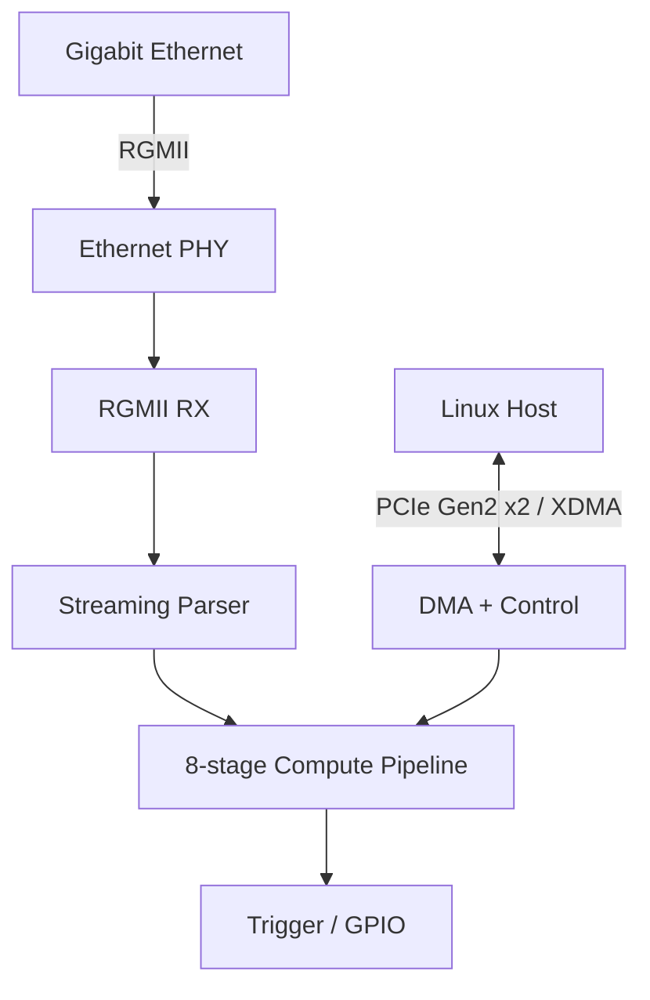

# FPGA Acceleration Portfolio — System Architecture

**Platform:** ALINX AX7015B / Zynq-7000 XC7Z015
**Scale:** 13 progressive projects
**Evidence highlights:** 841 MB/s H2C and 820 MB/s C2H measured XDMA throughput; integrated Project 13 at 125 MHz; 168 ns cycle-derived FPGA-logic latency budget.

---

## 1. System Overview

The portfolio combines a programmable-logic data path with a PCIe/Linux control path. The integrated Project 13 design receives RGMII traffic, parses a target pattern, passes data through an 8-stage compute pipeline, and produces a trigger output. Separate projects develop and validate the supporting Ethernet, PCIe, AXI/BRAM, CDC, and compute components.

```mermaid
graph TD
    ETH[Gigabit Ethernet] -->|RGMII| PHY[Ethernet PHY]
    PHY --> RX[RGMII RX]
    RX --> PARSER[Streaming Parser]
    PARSER --> NPU[8-stage Compute Pipeline]
    NPU --> GPIO[Trigger / GPIO]
    HOST[Linux Host] <-->|PCIe Gen2 x2 / XDMA| CTRL[DMA + Control]
    CTRL --> NPU
```

---

## 2. Data Plane

### RGMII receive path

- Uses FPGA DDR input primitives for receive-path capture.
- Hardware bring-up used Vivado ILA and packet injection to diagnose alignment/frame-start problems.
- Stable 1 Gbps receive operation was demonstrated in the Project 09 workflow.

### Parser

- Streaming target-pattern detection.
- The parsing decision is registered in the packet-processing pipeline.

### Compute

- Project 13 uses an 8-stage integrated compute path at **125 MHz**.
- Project 12 separately experiments with a DSP48E1 processing element at **250 MHz**.
- The 250 MHz Project 12 result is not treated as the integrated Project 13 clock rate.

---

## 3. Control Plane

### PCIe XDMA

- PCIe Gen2 x2 using Xilinx XDMA.
- Linux host integration with the XDMA driver and transfer utilities.
- Recorded measurements: **841 MB/s H2C** and **820 MB/s C2H**.

### AXI / BRAM

- AXI/AXI-Lite control and register-access experiments.
- BRAM-backed paths used for configuration and latency studies.

---

## 4. Clock-Domain and Reliability Work

- Multi-clock-domain experiments include two-flop synchronizers and Gray-code techniques.
- Project 13's recorded timing result shows the 125 MHz core meeting setup with **WNS +1.175 ns**, while CDC paths remained flagged and require explicit constraints.
- Because of that open CDC-constraint work, the integrated design is described as **hardware tested with mixed timing status**, not as globally timing-clean.

---

## 5. Integrated Latency Budget

The following is a **cycle-derived FPGA-logic budget**, not an independent time-domain measurement:

| Stage | Cycles @ 125 MHz | Time |
| --- | ---: | ---: |
| RGMII RX + MAC/parser | 4 | 32 ns |
| NPU pipeline | 16 | 128 ns |
| GPIO output | 1 | 8 ns |
| **Total FPGA logic** | **21** | **168 ns** |

PHY delay is excluded. No zero-jitter hardware measurement is claimed.

---

## 6. Verification

- Vivado XSim and self-checking SystemVerilog testbenches
- Tcl/Make build automation
- Vivado timing and utilization reports
- ILA/VIO hardware debugging
- Python and Scapy packet generation
- Linux XDMA transfer testing

See the individual project directories for project-specific scripts, reports, and validation notes.
